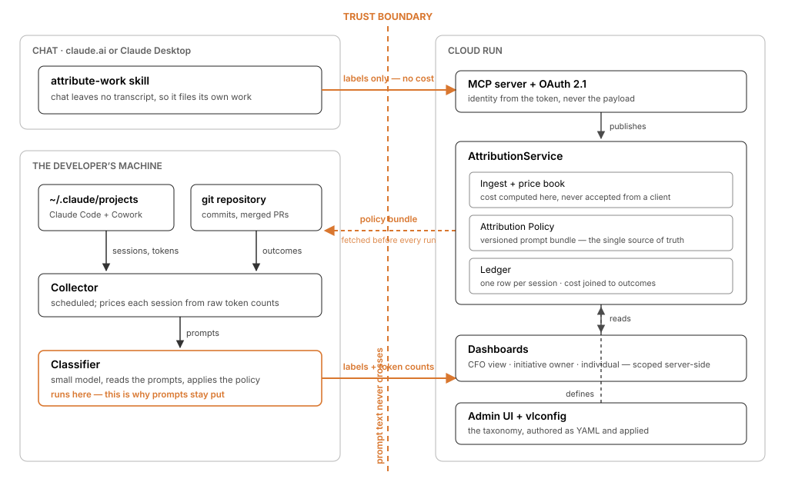

# ValueLedger

Cost attributed to business work, joined to verifiable output.

## ▶ Try it — no setup

**<https://valueledger-795896542461.us-central1.run.app>**

Pick a role on the landing page and you are in. Nothing to install, no key to paste —
credentials are handed over for you, because the data is synthetic.

| Role | Sees |
|---|---|
| **Finance / CFO** | company totals, every initiative, cost centers |
| **Initiative Owner** | only the initiatives they own |
| **Developer** | only their own sessions |

Scoping is enforced in the query layer, not the UI, so those genuinely differ — a member
who asks for someone else's rows gets their own back.

To reach it from Claude, the landing page has a copy-paste Desktop config and the
connector URL for claude.ai. Both are covered under **MCP server** below.

Claude Enterprise bills consumption across Claude Code, Cowork, and chat, and every dollar
is unlabeled. ValueLedger creates the missing record: **this $4.12 went to Payments
Migration, doing refactor work, and produced commit `a3f91c` which merged in PR #4412.**

Build spec: [SPEC.md](SPEC.md).

## Architecture



Everything that reads prompts runs on the developer's machine. Only labels, token
counts and outcomes cross into the cloud, which is what makes it installable inside
an organization that would never ship prompt text to a third party.

## Status

| Component | State |
|---|---|
| **AttributionService** — ledger, policy store, reports | ✅ built |
| **Productivity model** — baselines, sensitivity, caveats | ✅ built |
| **MCP server** — 4 tools, per-user tokens, JSON-RPC over HTTP | ✅ built |
| **OAuth 2.1** — discovery, DCR, PKCE (so claude.ai can connect) | ✅ built |
| **Collector CLI** — Claude Code + Cowork transcripts, git outcomes | ✅ built |
| **Classifier** — LLM, local, self-metered | ✅ built |
| **Admin UI** — data entry for everything the service needs | ✅ built |
| Seed generator — synthetic 90-day org | ✅ built |
| **Attribution skill** — chat surface, via MCP | ✅ built |
| **CFO dashboard** — published Artifact, reads live | ✅ built |

## Run it locally

```bash
./run.sh
```

First run creates a venv, seeds a synthetic 90-day org (40 users, 6 initiatives,
4 cost centers, ~1,100 sessions), and prints an API key. Then open
<http://127.0.0.1:8077> and paste the key in.

API docs at `/docs`.

### Try the role scoping

Scoping is enforced in the query layer, not the UI, so changing the acting user email in
the header genuinely changes what you can read:

| Email | Sees |
|---|---|
| `cfo@example.com` | everything — org totals, all initiatives, cost centers |
| `admin@example.com` | everything, plus policy, taxonomy, and baseline editing |
| any seeded member | only their own sessions |

Try changing a baseline on the **Productivity** tab — drop "slide" from 10 minutes to 6
and every figure moves. That sensitivity is the point: it is what separates a model from
a claim.

A member who explicitly requests another user's rows gets their own back, not a 403 —
the filter is applied server-side regardless of what was asked for.

## Configuration as files

The admin UI is fine for a demo and wrong for real setup: an initiative's
classification guidance is a paragraph of prose that wants drafting, reviewing and
version control, not a textarea. [`config/`](config/) holds the YAML that defines an
org; the service is what it gets applied to.

```bash
./vlconfig init      # starter config with sensible task types and activities
./vlconfig export    # pull a running service's state into config/
./vlconfig diff      # what apply would change
./vlconfig apply     # push it
./vlconfig apply --prune   # also delete what the files no longer define
```

| File | What you edit |
|---|---|
| `config/initiatives.yaml` | **the main one** — initiatives and their classification prompts |
| `config/users.yaml` | people, roles, cost centers |
| `config/baselines.yaml` | the productivity assumptions, with their sources |
| `config/taxonomy.yaml` | task types and activities (change these last) |
| `config/org.yaml` | org settings and the two classifier prompts |

`config/` currently holds the **Northwind demo org**, exported from the live service —
useful as a worked example of how much detail the guidance needs.

Apply is idempotent, and re-applying an unchanged file publishes **no** new policy
version — `policy_version` is how a classification is traced back to the prompts that
produced it, so it only moves when something really changed.

## CFO dashboard

A published Artifact that reads the live API and falls back to an embedded snapshot:
<https://claude.ai/artifact/MpZ4c9t7pyf2P8Cg9rjW1v>

Source in [dashboard/ledger.html](dashboard/ledger.html). Measured figures and the one
modelled figure are kept visually apart, and the productivity band leads with its
sensitivity range rather than its midpoint.

## Attribution skill (chat)

Claude Code and Cowork write transcripts to disk; chat does not. The
[attribute-work skill](skill/attribute-work/SKILL.md) is how chat work reaches
the ledger — it fetches the policy over MCP, classifies the conversation, and
publishes labels.

```bash
cp -R skill/attribute-work ~/.claude/skills/
```

Then say *"attribute this work"* in any conversation. Chat records carry
`cost_basis: unknown` by construction: the model cannot observe its own token
usage, so it classifies intent and never reports cost.

## Collector

Reads your real Claude Code and Cowork transcripts and publishes them to the
ledger. See [collector/README.md](collector/README.md).

```bash
export ANTHROPIC_API_KEY=sk-ant-...
export VALUELEDGER_URL=... VALUELEDGER_API_KEY=... VALUELEDGER_USER=...
python -m valueledger_collector.cli --full --dry-run   # costs nothing
python -m valueledger_collector.cli --full             # backfill
python -m valueledger_collector.cli                    # daily
```

Verified against 24 real sessions on a live machine: 2,549 usage records,
$520.33 reconstructed, both surfaces. A re-run deduped all 2,549 and created
nothing — idempotency holds on real data, not just seeds.

## Reviewing this in 10 minutes

1. **Open the dashboard as Finance.** Note coverage is reported as *two* numbers —
   classification ~96%, cost ~87%. The gap is chat: classifiable, not priceable.
2. **Look at dark spend** (~19%) — money on sessions that produced no durable artifact.
   It needs cost and outcomes joined at session grain, which a FinOps tool does not have.
3. **Open the Productivity tab.** The headline is 1.59×, but the range is 0.82×–3.21× and
   the product leads with the fact that the low end falls below 1×. Change a baseline and
   every number moves.
4. **Switch to the Developer role** and try to see someone else's spend.
5. **Connect over MCP** and ask it something. Then try to break the trust boundary:
   publish an attribution naming an initiative that does not exist, or claiming a
   different user and a cost.

## MCP server

JSON-RPC 2.0 at `POST /mcp`. Four tools:

| Tool | Purpose |
|---|---|
| `get_attribution_policy` | the versioned prompt bundle — call before classifying |
| `publish_attribution` | ingest for surfaces with no local transcript (chat) |
| `query_my_spend` | your own spend and output, scoped by your token |
| `query_initiative` | one initiative, if you own it or hold finance/admin |

**Identity comes from the bearer token, never the payload.** Mint a per-user token on the
Setup tab, or:

```bash
curl -X POST "$URL/v1/mcp-tokens?user_email=someone@example.com&label=laptop"   -H "X-API-Key: $KEY" -H "X-User-Email: admin@example.com"
```

Verified: a `publish_attribution` call carrying `user_email: cfo@example.com`,
`cost_usd: 9999` and `cost_basis: measured` in its payload was stored as
`noah.cruz@example.com` / `unknown`, with all three spoofed fields ignored. A call naming
an initiative that isn't in the policy is recorded `unclassifiable` rather than creating
one. Revoked and unknown tokens are refused.

## What the service does

**Ledger.** One row per session, joined to request-grain usage, one classification, and
many outcome events. Raw token counts are stored alongside computed cost so the whole
ledger is recomputable when prices change.

**Pricing.** Cost is computed server-side from token counts and a price book, and is
**never accepted from a client** — a model-mediated caller could supply anything. Unknown
models are stored with `priced=false` rather than silently costed at zero.

**Attribution Policy.** A versioned prompt bundle, not just a taxonomy. Every initiative,
task type, and activity carries its own classification guidance, which is sent verbatim to
the classifier. Editing guidance republishes the policy at a new version; clients pick it
up on their next fetch with no client release.

**Metrics.** Attributed spend, merged PRs, cost per merged PR, **dark spend** (money on
sessions that produced no durable artifact), **rework spend** (work later reverted), and
**classification overhead** (what the classifier itself cost, as a % of tracked spend).

Coverage is always reported as **two numbers** — classification and cost — and never
collapsed into one, because chat can be classified but not priced.

**Productivity gain** — the one modelled metric, and structurally separated from the rest
so it can't be mistaken for a measurement:

```
productivity  =  units produced  ×  what a unit costs a human
                 └── MEASURED ──┘     └────── ASSUMED ──────┘
```

We measure units produced and actual session time. The baseline — *"a slide takes a human
10 minutes"* — is a **customer-owned record** with a named source, a trust level, and a
low/high band. Every response carries `measured`, `modelled`, `sensitivity`,
`modelled_coverage`, `assumptions`, and `caveats`; a bare speedup number is never returned.

On the seeded org this reads **1.59× (range 0.82× – 3.21×)**. The low end falls below 1×,
and the UI says so in the headline rather than quoting the midpoint — at the pessimistic
baseline, that work was not faster than a human. That is the metric behaving correctly.

Two conservatisms: **only accepted work counts** (a reverted session contributes full cost
and zero productivity), and **human time is capped per session** (default 90 min, because
wall-clock overstates attention).

**No dollar value of work produced is ever computed.** Hours saved is reported; hours saved
× a loaded rate is not — that stacks a second assumption on the first, and is where this
class of metric stops being credible.

## Invariants worth knowing

These are enforced, not aspirational:

- **Ingest is idempotent.** Dedupe is on `session_id` and `(session, record_uuid)`, so
  re-running a full backfill can never double-count.
- **Chat cannot claim measured cost.** The model cannot see its own token usage, so a chat
  session arriving with `cost_basis=measured` is rejected at 400.
- **The classifier may only choose from the policy.** A label naming an initiative that
  does not exist is dropped and the session becomes `unclassifiable` — it is never created.
  A prompt-injected document cannot move money onto someone else's books.
- **`unclassifiable` is a first-class outcome**, not an error. It clusters in the admin
  view as *work your taxonomy does not describe*, which is how initiatives get discovered.
- **A baseline with no credible source blocks policy readiness** and taints every
  productivity figure that uses it, in-product.

## Layout

```
service/
  app/
    main.py       FastAPI app, static mount
    models.py     SQLAlchemy models — the ledger
    db.py         engine (SQLite local, Postgres deployed)
    pricing.py    price book + cost computation
    policy.py     Attribution Policy bundle + validation
    metrics.py    aggregation: dark spend, rework, coverage
    productivity.py  measured vs modelled, sensitivity, caveats
    auth.py       API key + role scoping
    seed.py       synthetic 90-day org
    routers/      admin · policy · events · reports · review
  static/         admin UI (vanilla JS, no build step)
  Dockerfile
run.sh            local
deploy.sh         Cloud Run
```

## Deploy

```bash
PROJECT_ID=your-project ./deploy.sh
```

Cloud Run, scale-to-zero. Without `DATABASE_URL` it falls back to SQLite on the container
filesystem — fine for a demo, wrong for anything else. For persistence set a Cloud SQL
instance:

```bash
PROJECT_ID=your-project \
CLOUDSQL_INSTANCE=your-project:us-central1:valueledger \
DATABASE_URL='postgresql+psycopg://user:pass@/valueledger?host=/cloudsql/your-project:us-central1:valueledger' \
./deploy.sh
```

## What I'd build next

In order, per [SPEC.md](SPEC.md) §10:

1. **Classifier** — runs on the machine against the fetched policy bundle, returns three
   labels with confidences and a rationale, counts work units per
   `output_extraction_guidance`, and meters its own cost.
2. **Collector CLI** — parses Claude Code *and* Cowork transcripts from
   `~/.claude/projects/`, rolls up usage, captures git outcomes. Two scheduled tasks:
   `collect --full` (with a `--dry-run` cost preview) and a daily incremental.
3. **Attribution skill** — the chat surface, where no local transcript exists.
4. **Dashboard** — the three role-scoped views as a published Artifact.

## Known gaps

- **Session ownership can be reassigned silently.** Sessions dedupe on
  `(org_id, session_id)`, which is what makes `collect --full` safe to re-run —
  but it means re-uploading the same machine's history under a different
  `--user` moves those rows to the new owner instead of duplicating them, with
  nothing in the response saying so. Right grain, missing signal.
- **The two write paths disagree about identity.** `publish_attribution` over
  MCP derives the user from the bearer token and ignores the payload. `POST
  /v1/events` trusts `user_email` in the payload. That is defensible when the
  org key is a deployment secret and wrong when it is printed on a public
  landing page, as it is in demo mode.
- **Dev auth on the REST API.** `X-User-Email` is trusted alongside a valid org API key.
  Production replaces this with Google OIDC; the role-scoping logic behind it does not
  change. **The MCP server does not have this weakness** — it uses real per-user bearer
  tokens, so identity there is already derived rather than asserted.
- **`create_all`, not migrations.** Schema changes need a fresh DB. Alembic before there
  is data anyone cares about.
- **Outcome reconciliation is stubbed.** `POST /internal/reconcile` is specced for a
  Cloud Scheduler job that polls GitHub for merge status; the endpoint is not built yet,
  so `pr_merged` currently arrives only from the seed or from an explicit outcomes POST.
- **Cost drifts from the invoice.** Reconstructed from list prices, so contract discounts
  and batch pricing are invisible. The ledger is recomputable by design; it should never
  be presented as invoice truth.
